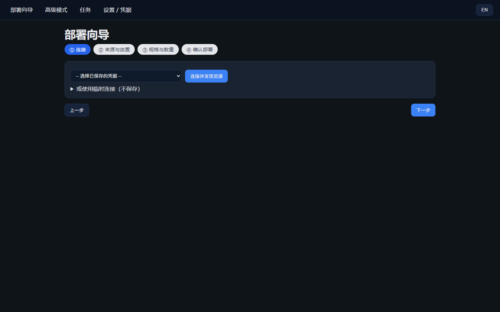
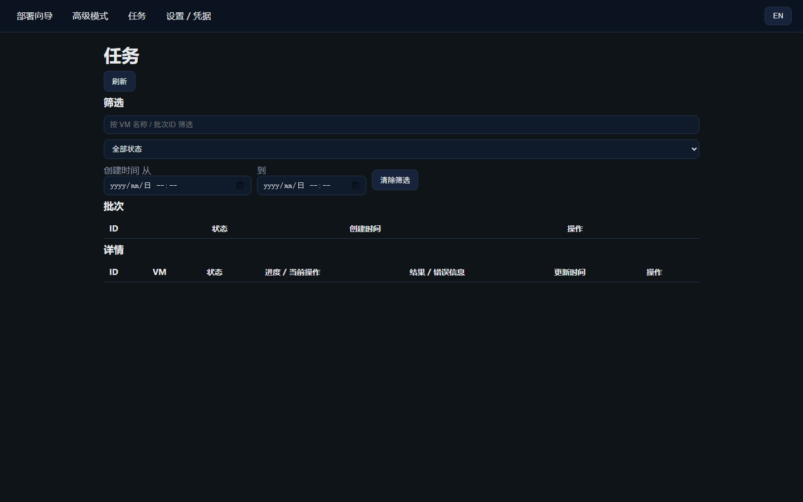

# vSphere Auto — Batch VM Deployment for vSphere

> [English](README.md) | [中文](README.zh-CN.md) | [ไทย](README.th.md)

  

**The problem it solves**: the built-in vSphere UI creates one VM at a time, with specs / network / IP filled in by hand for each. This tool turns that into a single operation — a 4-step web wizard or one CLI command that batch-creates dozens of identical VMs: automatic vSphere resource discovery, manual folder / datastore / host placement when you need control, concurrent deployment, static IP & hostname injected at first boot, live task progress, and failures reported with a clear cause and how to fix it.

- Template clone (recommended) or fresh install from ISO
- DHCP or static IP (netmask / gateway / DNS / hostname written into the VM via Guest Customization)
- Idempotent re-runs: interrupted batches can be re-executed without duplicating VMs
- Encrypted credential storage; secrets redacted from logs and output

> Runtime: Linux · Python 3.11+ · vCenter 6.7 / 7.0 U3+ / 8.0+ or direct ESXi

| Deployment Wizard | Tasks (live progress, filters, error hints) |
|-------------------|---------------------------------------------|
|  |  |

---

## Use Cases

- **Bulk test / dev / demo environments**: dozens of identical VMs in one go; tear them down and re-provision anytime thanks to idempotency
- **Standardized delivery**: fixed specs + planned static IPs, delivered ready-to-use with IP/gateway/DNS/hostname already set
- **Fresh installs from ISO**: no template available? batch-install from ISO with network customization
- **Precise placement**: manually pick target folder (hierarchical tree), datastore, and host (including host↔datastore mount validation); leave unset for auto-selection

## Compatibility

| Item | Requirement |
|------|-------------|
| vCenter | 6.7 / 7.0 U3+ / 8.0+ (verified against vCenter 6.7.3) |
| ESXi | 6.7 / 7.0 / 8.0; direct ESXi connections work, though some guest-customization features are limited (automatic fallback) |
| Templates | VMware Tools / open-vm-tools installed and running (required for static-IP customization) |
| Operating system | See "Requirements" below |

> **cloud-init template note**: most CentOS 7.9 cloud images ship cloud-init, which overwrites the vCenter-applied static IP/hostname at first boot. For static-IP deployments, disable cloud-init network configuration in the template:
> ```bash
> echo "network: {config: disabled}" > /etc/cloud/cloud.cfg.d/99-disable-network-config.cfg
> ```
> DHCP deployments are unaffected.

---

## Requirements

- **OS**: Linux (systemd optional). Recommended: **Ubuntu 22.04/24.04 LTS**, **RHEL/Rocky/Alma 8/9**, **Debian 12**. CentOS 7 still works (`install.sh` provisions Python 3.11 without root) but is EOL — not recommended for new deployments.
- **Python**: 3.11+ (`install.sh` detects and installs it automatically; usually nothing to do manually)
- **Network**: HTTPS (443) reachability to vCenter/ESXi; first install needs access to pypi.org (offline hosts should preinstall Python 3.11 and dependencies)
- **vSphere account**: permissions to create/clone VMs, read datacenters/datastores/networks/folders, and run guest customization (e.g. `Administrator@vsphere.local`)

## Quick Install

```bash
# Option 1: git
git clone https://github.com/ilysom0611/vsphere-auto.git
cd vsphere-auto
bash install.sh     # creates the venv, installs dependencies, initializes the encryption key
bash start.sh       # starts the web service, default http://localhost:8080

# Option 2: one-liner without git (clones the repo to ./vsphere-auto automatically)
curl -fsSL https://raw.githubusercontent.com/ilysom0611/vsphere-auto/main/install.sh | bash
bash vsphere-auto/start.sh
```

For production, register it as a systemd service:

```bash
sudo bash install.sh --install-service   # substitutes paths automatically; autostart + restart on crash
```

Docker is not provided yet.

### Stopping the Service

```bash
# Installed as a systemd service
sudo systemctl stop vsphere-auto        # also: start / restart; check autostart with: systemctl is-enabled vsphere-auto

# Running in the foreground via bash start.sh: just Ctrl+C

# Started manually in the background (nohup etc.)
pkill -f 'vsphere_auto serve'
```

Stopping does not affect saved credentials or task history (all under `state/`, restored on next start; interrupted batches are marked `interrupted`).

### Updating

```bash
cd vsphere-auto
git pull origin main
bash install.sh     # refreshes the venv if dependencies changed (safe to re-run)
# Restart according to how you run it:
sudo systemctl restart vsphere-auto    # or: bash start.sh again
```

The `state/` directory (credential DB, task records, encryption key, IP pools) is separate from the code and survives upgrades. Back up `state/` before a major version upgrade.

---

## Usage: Web Wizard (recommended)

Open `http://<server>:8080` and deploy in 4 steps:

| Step | Action |
|------|--------|
| ① Connect | Pick a saved credential → resources are discovered automatically (templates/folders/datastores/hosts/networks/ISOs) |
| ② Source & Placement | Choose a template (or ISO); **manually select** folder (tree), datastore, host, network — the page warns and blocks combos where the host doesn't have the datastore mounted |
| ③ Specs & Count | VM count, naming pattern (e.g. `demo-{index:02d}`), CPU/memory/disk, provisioning type, IP mode (DHCP / static: netmask·gateway·DNS), concurrency |
| ④ Review & Deploy | A deployment plan is generated for review → confirm to deploy and jump to the Tasks page |

**Tasks page (/tasks)**: shows each VM's current operation and clone percentage in real time; failures show a **classified cause with a suggested fix** (e.g. "the selected host does not have this datastore mounted") plus the raw error; filter by name/status/creation time; delete completed historical batches and tasks.

**Settings page (/settings)**: save vCenter credentials (passwords Fernet-encrypted), one-click connectivity test.

> `/advanced` is the full form for users who prefer YAML-style configuration; functionally equivalent to the wizard.

### CLI (same core engine)

**1. Save a vCenter credential** (one-time per vCenter; supply the password via `--password` or the `VSPHERE_PASSWORD` environment variable — it is stored encrypted):

```bash
vsphere-auto creds add --name prod-vc --host 10.0.0.10 --username administrator@vsphere.local
vsphere-auto creds test prod-vc     # verify the connection works ("prod-vc" = the name you just saved)
vsphere-auto creds list             # show all saved credentials
```

**2. Discover resources** — see which templates/datastores/hosts/networks are available on that vCenter:

```bash
vsphere-auto discover --creds prod-vc
```

**3. Describe what to deploy** in a YAML file:

```bash
cp config/config.example.yaml my.yaml   # start from the commented example
# edit my.yaml: VM count & specs, template name, IP mode, naming pattern…
```

**4. Preview, then deploy**:

```bash
vsphere-auto plan --config my.yaml --creds prod-vc      # dry run: shows the planned VMs and resource selections, changes nothing
vsphere-auto deploy --config my.yaml --creds prod-vc --yes   # actually creates the VMs (--yes skips the interactive confirmation)
```

Or run everything through the web UI instead:

```bash
vsphere-auto serve --port 8080      # starts the web service at http://localhost:8080
```

**Command parameters** (values above such as `prod-vc` and `10.0.0.10` are examples — substitute your own):

| Parameter | Used with | Meaning |
|-----------|-----------|---------|
| `--name prod-vc` | creds add | A label you invent for this credential, referenced later as `--creds prod-vc` |
| `--host 10.0.0.10` | creds add | Your vCenter (or ESXi) address — **fill in your real one** |
| `--username …` | creds add | vSphere account, e.g. `administrator@vsphere.local` — **fill in your real one** |
| `--password` | creds add | Better to omit: pass the password via the `VSPHERE_PASSWORD` environment variable so it stays out of shell history |
| `--port 443` | creds add, discover | SDK port; 443 is almost always correct |
| `--type vcenter` | creds add | `vcenter` (default); use `esxi` when connecting directly to an ESXi host |
| `<name>` | creds test | The credential name (or numeric ID shown by `creds list`) to verify |
| `--creds prod-vc` | discover / plan / deploy | Which saved credential to use |
| `--out inventory.json` | discover | Optional: also write the discovered inventory to a file |
| `-c my.yaml` | plan, deploy | Path to your spec file (`--config`) — **fill in your own file** |
| `--yes` | deploy | Skips the interactive confirmation — required in scripts |
| `--port 8080` | serve | Web UI port |
| `--host` (serve) | serve | Bind address, default `0.0.0.0`; use `127.0.0.1` for local-only access |

Exit codes: `0` all succeeded / `2` partial success / `1` failure — easy to check from scripts.

---

## Reliability

- **Idempotent**: re-running the same spec skips existing VMs (matched by name + folder) — never clones twice
- **Crash-safe**: after a service crash, leftover running/pending tasks are marked `interrupted` on startup and can simply be re-run
- **IP pool protection**: pool exhaustion aborts the whole batch and rolls back allocated leases — never half-deployed batches
- **Confidentiality**: passwords encrypted at rest; sensitive values redacted from logs, task records and inventory; never put plaintext passwords in YAML (use `VSPHERE_PASSWORD` or a saved credential)

## Security Essentials (read before exposing the service)

1. **Always set an API token**: `export VSPHERE_API_TOKEN=<random-string>` and restart; all API requests must then carry the token (the browser prompts once on the first 401 and remembers it). Without it the API is unauthenticated and a loud warning prints at startup.
2. **Default bind is `0.0.0.0`**: use `VSPHERE_HOST=127.0.0.1` for local-only access; for cross-network access put nginx/caddy (TLS + auth) in front and restrict port 8080 with a firewall.
3. **vCenter TLS verification is currently disabled** (a compatibility trade-off for 6.7 self-signed certificates) — keep the management network trusted.

## Environment Variables

| Variable | Purpose |
|----------|---------|
| `VSPHERE_STATE_DIR` | Runtime state directory (credentials DB / task DB / IP pools / key), default `<repo>/state` |
| `VSPHERE_API_TOKEN` | When set, enables API authentication (Bearer / X-API-Token header) |
| `VSPHERE_HOST` | Web bind address, default `0.0.0.0` |
| `VSPHERE_AUTO_KEY` | External Fernet key (by default auto-generated at `state/.fernet.key`; **back it up — lost key means saved passwords are unrecoverable**) |
| `VSPHERE_PASSWORD` | vCenter password for CLI/web flows not using a saved credential |
| `VSPHERE_DEBUG` | `1` enables debug logging (forces loopback binding) |

---

## FAQ

**Cannot connect to vCenter (especially 6.7)?**
Run `vsphere-auto creds test <name>` for the exact error. TLS 1.0 / legacy cipher issues on old 6.7 hosts are handled automatically by the client; if it still fails, check 443 reachability (`curl -vk https://<vc>:443/sdk`) and any proxy/firewall. Run `VSPHERE_DEBUG=1 bash start.sh` for full stack traces.

**Static IP / hostname not applied?**
Make sure VMware Tools is running inside the template; cloud-init templates need their network configuration disabled as described above. DHCP deployments get no injection by design.

**Discover shows DC/clusters = 0 with direct ESXi?**
Expected — ESXi has no datacenter/cluster concept; just pick the host and datastore directly.

**How do I rotate a password?**
Edit the credential on the Settings page and enter a new password (leave blank to keep the current one), or run `vsphere-auto creds update <id> --password '***'`.

---

## Support

Found a bug or have a feature request? Please [open an issue](https://github.com/ilysom0611/vsphere-auto/issues).

---

## License

This project is licensed under the **[MIT License](LICENSE)** — free to use, modify, distribute and commercialize; the only requirement is keeping the original copyright and license notice (provided "as is", no warranty).

All third-party dependencies use permissive licenses compatible with MIT — no copyleft obligations, no additional authorization needed for commercial use:

| Dependency | License |
|------------|---------|
| pyvmomi, requests, cryptography | Apache-2.0 (cryptography dual Apache-2.0 / BSD-3) |
| flask, jinja2 | BSD-3-Clause |
| waitress | Zope Public License 2.1 (ZPL-2.1) |
| pyyaml, pydantic, typer, rich, tenacity, hatchling | MIT |
